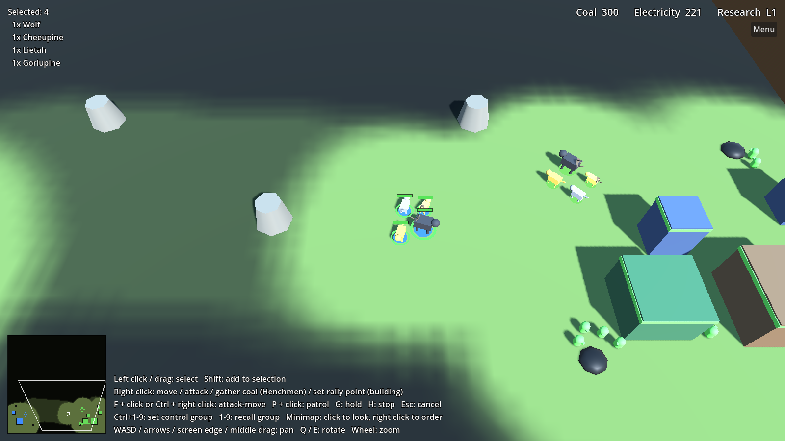

# Impossible Creatures Remake

A fan remake of Relic Entertainment's *Impossible Creatures* (2003), built in **Godot 4** with GDScript.

> This is an unofficial, non-commercial fan project. It is not affiliated with or endorsed by
> Relic Entertainment, Microsoft, or THQ Nordic. No original game assets are included; all art
> and audio in this repository are original placeholders.




## Status

Milestones 1 (**core RTS loop**), 2 (**combat**), 3 (**economy and base building**), 4 (**the
creature combiner**) and 6 (**skirmish**) are working with placeholder art:

- **Skirmish setup**: choose the map (Island Clearing, Canyon, Lakeside, or the 4-player Crossroads), how many
  players (2–4), free-for-all or 2 vs 2, the computer opponents' difficulty (Easy, Normal, Hard) and
  whether fog of war is on
- **Multiplayer vs AI**: one computer opponent per extra player. In 2 vs 2 you're teamed with the
  neighbouring base: allies don't fight, share vision, and win together. You're always blue, allies
  green, enemies red / yellow / purple
- **Fog of war**: you only see what your creatures and buildings see; explored ground stays dimmed,
  enemy buildings stay marked once found, enemy creatures only show while in sight, and rocks and coal
  appear as you explore. An enemy building destroyed out of sight leaves a grey "last seen" ghost
  until you look again. The AI plays by the same rules.
- **Population** (AoE2-style): every creature and Henchman takes one slot. A Lab houses 10 and each
  **House** 5, up to 100. At the cap, production waits and the HUD says to build more Houses.
- **Labs heal** friendly creatures within 10 m (4 health per second)
- **Soundbeam Tower** (research level 2): a defensive tower that zaps enemy creatures within 10 m,
  flyers included
- **Research Center** (AoE2 Blacksmith-style): tiered creature upgrades — Bite & Claw (melee damage),
  Sharp Quills (ranged damage), Tough Hide (melee armor) and Scales (ranged armor), three tiers each,
  plus Fleet Feet (+10% speed). Each tier needs the one before it and a higher research level.
- **Melee and ranged armor**: creatures have separate armor against bites/claws and against quills
  and tower beams. Crocodile, Rhino, Scorpion, Elephant and Porcupine torsos resist ranged hits.
- **Workshop**: Henchman upgrades — Coal Sacks and Coal Wagons (carry 15, then 20 coal), Sturdy Boots
  (+20% speed), Quick Hands (gather 30% faster) and Builder's Tools (build 30% faster)
- **Water**: Canyon is split by a river with three fords; Lakeside has a lake in the middle with a
  ford across it. Walking creatures go round deep water or wade through fords; nothing can be built
  on water.
- **Aviary**: flying designs are made here (the Creature Chamber makes the ones that walk). It also
  sells flyer upgrades: Strong Wings (+15% flyer speed) and Keen Eyes (flyers see 4 m further), from
  research level 2. The AI builds one once it can make its flyers.
- **Swimmers**: legs decide. Crocodile legs are amphibious (walk and swim); Shark and Electric Eel
  have fins, and a hybrid with fins front and back lives only in deep water. Land melee creatures
  can only hit swimmers near the shore, and water-only creatures only reach what's near the water;
  ranged creatures and flyers hit anything. The **Water Chamber** (built on a shore, only on maps with
  water) makes your swimming designs; the Creature Chamber makes the ones that walk. It sells swimmer
  upgrades: Streamlining (+15% swim speed, research L2) and Deep Lungs (water-only creatures reach
  2 m further up the shore, research L3). The AI builds one
  too on water maps and patrols the water nearest you with its water-only creatures.
- **Minimap**: terrain under the fog, coal, buildings, creatures and your camera's view; click to look,
  right click to send the selection there

- **Creature combiner**: pick two of 17 animals (Bat, Bison, Chameleon, Cheetah, Crocodile, Eagle,
  Electric Eel, Elephant, Gorilla, Kangaroo, Lion, Porcupine, Rhino, Scorpion, Shark, Skunk, Wolf), choose which one each body part comes from, see
  the hybrid and its stats live, and save an army of up to 9 designs. Matches start with 600 coal's
  worth of your army, and the Creature Chamber produces more.
- Part-based abilities: flying (Eagle or Bat wings, for hybrids light enough), poison (Scorpion
  tail), ranged quills (Porcupine tail), charge (Rhino head) and leap (Kangaroo hind legs)
- Hybrid models assembled from their parts, coloured by animal, with a team-coloured base disc

- Top-down RTS camera: keyboard, screen-edge and middle-drag panning, rotation and smooth zoom, clamped to the map
- Unit selection: click, shift-click, drag box, control groups, double click for all of a type
- Move orders: navmesh pathfinding around obstacles, local avoidance between units, grid formations that move at the slowest unit's speed
- Combat: health, armor, melee hits, homing projectiles for ranged units, poison, death animation
- Target choice: units prefer targets their attacks get through, finish off wounded ones, and focus
  on what nearby allies are already attacking
- Ranged creatures back off from melee attackers that come for them, then keep shooting
- Orders: move, attack, attack-move, patrol, hold position, stop; Shift queues them
- Alerts when your creatures or buildings are attacked (Space looks there), idle Henchman key
- Unit behavior: idle units engage enemies in sight, chase up to a leash range and then return to their post; units fight back when hit and call nearby allies to help
- Economy: coal (gathered from coal piles by Henchmen) and electricity (made by Electrical Generators)
- Base building: Lab, Electrical Generator and Creature Chamber, placed with a ghost preview and
  constructed by Henchmen; the navmesh updates as buildings go up or come down
- Production queues (up to 5, cancel refunds), rally points
- Buildings can be attacked and destroyed, and nearby units come to defend them
- Win by destroying every enemy unit and building
- **Research**: each team starts at research level 1 and researches levels 2–5 at its Lab; the
  Creature Chamber only produces hybrids at or below your research level
- Enemy AI that builds its own base (Creature Chamber, Generators, rebuilding if it loses
  everything), gathers coal, expands with new Labs when its coal runs low, researches, produces the
  strongest creatures it has unlocked, pulls wounded creatures back to heal, rushes fighters to
  defend its base, and attacks what it has scouted (or where your base probably is) in waves that
  grow each time
- Health bars, a resource counter, and a command panel with build and production buttons
- Creature types defined as data (`CreatureStats` resources); the combiner will generate these later
- Headless tests

See [docs/ROADMAP.md](docs/ROADMAP.md) for what comes next.

## Running

1. Install [Godot 4.3+](https://godotengine.org/download) (the standard build; .NET isn't needed).
2. Open Godot, click **Import**, and select this folder's `project.godot`.
3. Press **F5**. From the main menu, open the **Creature Combiner** to design your army, then
   **Play Skirmish** to pick a map and difficulty.

## The combiner rules

| Body part | Contributes |
| --- | --- |
| Head | Bite damage, some armor (Rhino, Elephant, Crocodile); Rhino: **charge**; Bat: **sonic**; Wolf: **pack hunter** |
| Torso | Health, most of the melee armor and all of the ranged armor; most of the hybrid's size; Gorilla: **frenzy**; Elephant: **trample**; Chameleon: **camouflage**; Bison: **herding**; Electric Eel: **electric** |
| Front legs | Claw damage (Gorilla fists, Scorpion pincers, Eagle talons) and half the speed |
| Back legs | The other half of the speed; Kangaroo legs: **leap** |
| Legs (both pairs) | Swimming: Crocodile legs swim and walk; Shark and Eel fins only swim (fins front and back: water only) |
| Tail | Poison (Scorpion), a ranged quill attack (Porcupine) or **stink** (Skunk) |
| Wings | Flight (Eagle, Bat), if the hybrid's size is 1.1 or less |

- **Charge**: sprints (1.8× speed) at a target at least 4 m away; the first hit does double damage.
  8 s cooldown.
- **Leap**: jumps a 1.5–7 m gap to land in reach of the target. 6 s cooldown. Flyers don't leap.
- **Sonic screech** (Bat head): while fighting, every 7 s deals 6 damage through armor to every
  enemy within 5 m, flyers included. A creature just hit is deafened for 3 s, so screeches don't
  stack. Bat heads also see 4 m further.
- **Pack hunter** (Wolf head): +15% damage for each other pack hunter within 6 m, up to +45%.
- **Frenzy** (Gorilla torso): below half health, attacks come 40% faster.
- **Trample** (Elephant torso): melee hits also deal half damage to enemies right next to the target.
- **Electric** (Electric Eel torso): every 6 s a hit shocks for 5 extra damage through armor and
  stuns the target for 1.5 s.
- **Herding** (Bison torso): +1 melee and ranged armor for each other herding creature within 6 m,
  up to +3.
- **Stink** (Skunk tail): enemies within 4 m of a stinker deal 25% less damage. Several stinkers
  don't stack.
- **Camouflage** (Chameleon torso): after standing still for 3 s without fighting, the creature
  vanishes for the enemy: they can't see, click or target it, even with the fog off. Moving,
  attacking or getting hit ends it. Enemies within 3 m, or with a Bat head (echolocation) within
  12 m, still spot it. Your own camouflaged creatures look see-through.
- Ranged creatures don't charge, leap or trample.

Legs from a small animal under a big body are slowed down, but nothing walks slower than 3.
A strength rating sets each hybrid's level (1–5) and cost: roughly the square root of effective
health (armor counts for more on a big body) times damage per second, scaled by speed and abilities,
so the same coal buys about the same fighting strength whatever the design. Armor subtracts from
each hit but never blocks more than 60% of it.

Flyers pass over buildings and rocks. Only ranged or flying creatures can hit them, except while a
melee flyer swoops down to fight, when its target can hit back. Names are portmanteaus, like the
original: Lion + Eagle = *Ligle*.

Animals are data files in `resources/animals/`; add a `.tres` there and it shows up in the combiner.

## Controls

| Input | Action |
| --- | --- |
| Left click | Select unit (Shift: add/remove); on an enemy, show its stats |
| Double click / Ctrl + click a unit | Select every unit of that type on screen (Shift: add) |
| Left drag | Box select (Shift: add); Henchmen are left out if the box has fighters in it |
| Right click ground | Move selected units |
| Right click enemy unit or building | Attack it |
| Right click coal (Henchmen selected) | Gather coal |
| Right click unfinished building (Henchmen selected) | Help build it |
| Shift + right click | Queue the order after the current ones (waypoints, attack then move on, ...) |
| Right drag with units | Line them up along the drag, facing away from where they are (Ctrl: attack-move) |
| Type buttons under a mixed selection | Click: keep only that type; Shift+click: drop it |
| Right click with a building selected | Set rally point (click the building itself to clear; on coal, new Henchmen gather there) |
| Command panel buttons (bottom right) | Build (Henchmen selected) or produce units (building selected); Shift + click makes 5 |
| Z X C V B N M, then T Y U I O | Press the command panel buttons in order (Shift: make 5) |
| Period (.) | Select and look at the next idle Henchman |
| Home | Select and look at your Lab (press again for the next one) |
| Space | Jump to the latest "under attack" alert |
| Minimap: left click / drag | Move the camera there |
| Minimap: right click (Ctrl: attack-move) | Order the selection there (or set a building's rally point) |
| Left click while placing | Place the building (Shift: keep placing) |
| F then left click, or Ctrl + right click | Attack-move (fight anything met on the way) |
| P then left click | Patrol between here and there (Shift: keep picking) |
| G | Hold position: stay put, only attack what's in reach |
| H | Stop |
| Esc | Cancel placement or order targeting, then deselect, then open the pause menu |
| F10 / Menu button | Pause menu (resume, restart, game speed, quit) |
| - / = | Slower / faster game (0.5×–2×) |
| Ctrl+1–9 / Shift+1–9 / 1–9 | Assign / add to / recall a control group (press twice to look at it) |
| WASD, arrows, screen edge, middle drag | Pan camera |
| Q / E | Rotate camera (Backspace: face north again) |
| Mouse wheel | Zoom (in towards the cursor) |

Keyboard bindings are registered in `scripts/autoload/input_actions.gd`. Any action you define
in **Project Settings → Input Map** with the same name overrides the default.

## Tests

```sh
godot --headless --path . res://tests/test_runner.tscn
```

The tests load the skirmish map and drive selection and orders through real input events. They
cover movement, combat, the leash, allies helping, the enemy AI, gathering, production, costs and
refunds, building placement and construction, navmesh updates, attacking buildings, victory, the HUD
buttons, the combiner rules for every animal pair, rosters and saving, flying, poison, charge, leap,
starting armies and the combiner screen. Combat tests use the hand-tuned units in `tests/fixtures/`
so they don't depend on combiner balance. They exit non-zero on failure, including when the test
script itself doesn't compile.

## Maps

All maps are generated by `tools/generate_maps.py` from short layout lists (rocks, coal, and up to
four bases with their Lab, Generator, Henchmen and army spawn point). Edit a layout and run `python3 tools/generate_maps.py` from the repository root to
rebuild the `.tscn` files, or add a new layout and list it in `scripts/autoload/game_settings.gd`.

| | Easy | Normal | Hard |
| --- | --- | --- | --- |
| First attack | after 6 min | after 4 min | after 2½ min |
| Attack waves | every 3 min, 6 creatures | every 2 min, 5–10 | every 90 s, 4–14 |
| Research | up to level 3 | up to level 4 | up to level 5 |
| Upgrades | none | first tier only | all |
| Labs | 2 | 2 | 3 |
| Army size | up to 15 | up to 30 | up to 60 |
| Pulls wounded creatures back | no | yes | yes |
| Thinks every | 3 s | 2 s | 1 s |
| Coal income | 70% | 90% | 120% |
| Max Henchmen | 5 | 7 | 9 |

Each wave waits for one more creature than the last, up to the attack size above.

## Project layout

```
scenes/
  main.tscn              Island Clearing map (generated)
  maps/canyon.tscn       Canyon map (generated)
  maps/crossroads.tscn   Crossroads, 4 players (generated)
  maps/lakeside.tscn     Lakeside, a lake with a ford (generated)
  ui/skirmish_setup.tscn Map, difficulty and fog choice
  camera/rts_camera.tscn Camera rig
  units/creature.tscn    Generic creature unit (placeholder capsule)
  units/henchman.tscn    Worker unit
  ui/main_menu.tscn      Title screen (the project's main scene)
  ui/combiner.tscn       Creature combiner
  buildings/building.tscn Generic building, sized and coloured from BuildingData
  world/coal_pile.tscn   Coal deposit
  props/rock.tscn        Obstacle
  fx/move_marker.tscn    Order feedback ring
  fx/projectile.tscn     Ranged attack projectile
scripts/
  autoload/              Global singletons (input bindings, Economy, Armies, Research, GameSettings,
                         MatchStats, Upgrades, Teams)
  combiner/              AnimalData, CreatureDesign, CreatureCombiner rules, ArmyRoster
  ai/                    Enemy AI controller
  buildings/             Building, BuildingData, UnitRecipe, build placement
  game/                  Win condition, fog of war
  world/                 Coal piles
  camera/                RTS camera
  selection/             Selection + order handling
  units/                 Creature behaviour, orders, combat, Henchman work, CreatureStats data
  ui/                    HUD, minimap, health bars, drag-select box, menus, combiner screen
shaders/                 Fog-of-war ground and minimap shaders
tools/generate_maps.py   Builds the map scenes from layout lists
resources/animals/       The animals the combiner draws parts from
resources/creatures/     Henchman stats
resources/buildings/     Building definitions (cost, size, production)
resources/recipes/       What each unit costs to produce
tests/                   Headless tests (fixtures/: hand-tuned test units)
```

Physics layers: 1 = `world` (ground, rocks), 2 = `units`, 3 = `buildings`, 4 = `resources` (coal).
Layers 1, 3 and 4 are baked into the navmesh.

### Costs (placeholder balance)

| | Coal | Electricity | Time |
| --- | --- | --- | --- |
| Henchman | 50 | — | 6 s |
| Hybrids | ~80–200 | 0–100 (by level) | ~8–15 s |
| Electrical Generator (+2 electricity/s) | 150 | — | 18 Henchman-seconds |
| Creature Chamber | 200 | 50 | 30 Henchman-seconds |
| Lab (+10 population) | 400 | — | 45 Henchman-seconds |
| House (+5 population) | 50 | — | 12 Henchman-seconds |
| Workshop | 150 | 50 | 25 Henchman-seconds |
| Water Chamber (on a shore) | 200 | 50 | 30 Henchman-seconds |
| Aviary | 225 | 75 | 30 Henchman-seconds |
| Research Center (research L1) | 175 | 75 | 30 Henchman-seconds |
| Soundbeam Tower (research L2; 14 damage / 1.2 s, 10 m) | 150 | 75 | 20 Henchman-seconds |

| Research Center upgrade | Coal | Electricity | Time | Needs |
| --- | --- | --- | --- | --- |
| Tier I: +1 (Bite & Claw, Sharp Quills, Tough Hide, Scales) | 100 | 50 | 30 s | research L2 |
| Tier II: another +1 | 200 | 100 | 45 s | research L3, tier I |
| Tier III: another +2 | 300 | 175 | 60 s | research L4, tier II |
| Fleet Feet: +10% speed for all creatures | 150 | 100 | 40 s | research L3 |

| Workshop upgrade | Coal | Electricity | Time | Needs |
| --- | --- | --- | --- | --- |
| Coal Sacks: Henchmen carry 15 coal | 100 | 25 | 30 s | — |
| Coal Wagons: Henchmen carry 20 coal | 200 | 75 | 45 s | research L3, Coal Sacks |
| Sturdy Boots: Henchmen +20% speed | 75 | 25 | 25 s | — |
| Quick Hands: gather 30% faster | 150 | 50 | 35 s | research L2 |
| Builder's Tools: build 30% faster | 100 | 50 | 30 s | research L2 |

Teams start with 300 coal and 100 electricity. Henchmen carry 10 coal per trip.

| Research | Coal | Electricity | Time |
| --- | --- | --- | --- |
| Level 2 | 100 | 50 | 25 s |
| Level 3 | 200 | 100 | 40 s |
| Level 4 | 300 | 175 | 55 s |
| Level 5 | 400 | 250 | 70 s |

Research one level at a time at the Lab (select it, then **Research L*n***). Cancelling refunds it.
