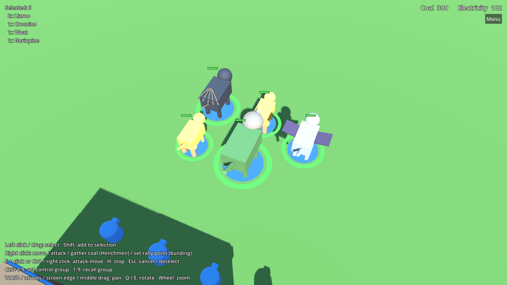
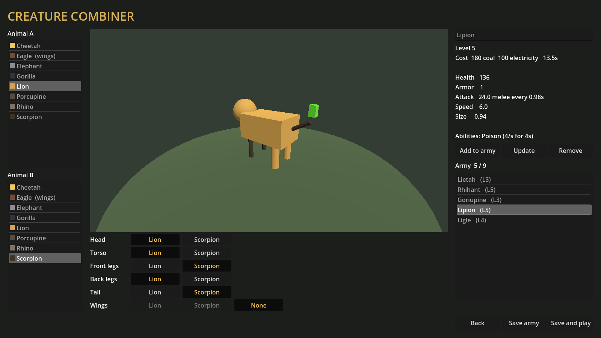
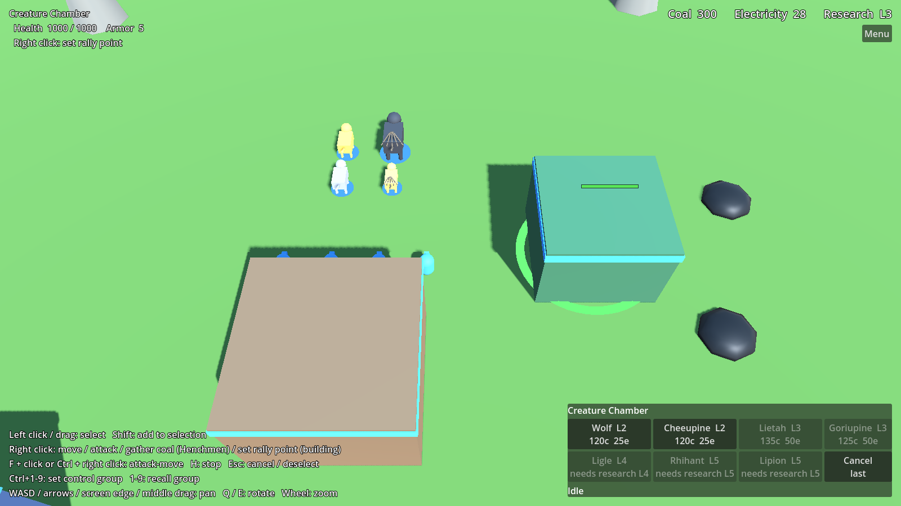
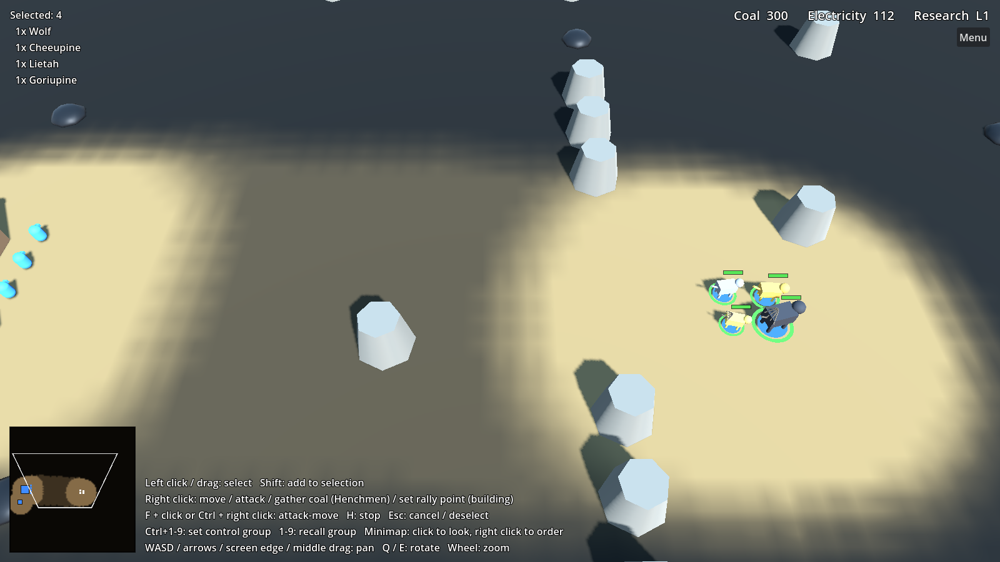

# Impossible Creatures Remake

A fan remake of Relic Entertainment's *Impossible Creatures* (2003), built in **Godot 4** with GDScript.

> This is an unofficial, non-commercial fan project. It is not affiliated with or endorsed by
> Relic Entertainment, Microsoft, or THQ Nordic. No original game assets are included; all art
> and audio in this repository are original placeholders.









## Status

Milestones 1 (**core RTS loop**), 2 (**combat**), 3 (**economy and base building**), 4 (**the
creature combiner**) and 6 (**skirmish**) are working with placeholder art:

- **Skirmish setup**: choose the map (Island Clearing or Canyon), the enemy's difficulty (Easy,
  Normal, Hard) and whether fog of war is on
- **Fog of war**: you only see what your creatures and buildings see; explored ground stays dimmed,
  enemy buildings stay marked once found, enemy creatures only show while in sight, and rocks and coal
  appear as you explore. An enemy building destroyed out of sight leaves a grey "last seen" ghost
  until you look again. The AI plays by the same rules.
- **Labs heal** friendly creatures within 10 m (4 health per second)
- **Soundbeam Tower** (research level 2): a defensive tower that zaps enemy creatures within 10 m,
  flyers included
- **Workshop**: buy team-wide upgrades — Coal Sacks (Henchmen carry 15 coal), Thick Hides (+2 armor,
  research level 2) and Fleet Feet (+10% speed, research level 3)
- **Minimap**: terrain under the fog, coal, buildings, creatures and your camera's view; click to look,
  right click to send the selection there

- **Creature combiner**: pick two of 12 animals (Bat, Cheetah, Crocodile, Eagle, Elephant, Gorilla,
  Kangaroo, Lion, Porcupine, Rhino, Scorpion, Wolf), choose which one each body part comes from, see
  the hybrid and its stats live, and save an army of up to 9 designs. Matches start with 600 coal's
  worth of your army, and the Creature Chamber produces more.
- Part-based abilities: flying (Eagle or Bat wings, for hybrids light enough), poison (Scorpion
  tail), ranged quills (Porcupine tail), charge (Rhino head) and leap (Kangaroo hind legs)
- Hybrid models assembled from their parts, coloured by animal, with a team-coloured base disc

- Top-down RTS camera: keyboard, screen-edge and middle-drag panning, rotation and smooth zoom, clamped to the map
- Unit selection: click, shift-click, drag box, control groups
- Move orders: navmesh pathfinding around obstacles, local avoidance between units, grid formations that move at the slowest unit's speed
- Combat: health, armor, melee hits, homing projectiles for ranged units, poison, death animation
- Target choice: units prefer targets their attacks get through, finish off wounded ones, and focus
  on what nearby allies are already attacking
- Ranged creatures back off from melee attackers that come for them, then keep shooting
- Orders: move, attack, attack-move, patrol, hold position, stop
- Unit behavior: idle units engage enemies in sight, chase up to a leash range and then return to their post; units fight back when hit and call nearby allies to help
- Economy: coal (gathered from coal piles by Henchmen) and electricity (made by Electrical Generators)
- Base building: Lab, Electrical Generator and Creature Chamber, placed with a ghost preview and
  constructed by Henchmen; the navmesh updates as buildings go up or come down
- Production queues (up to 5, cancel refunds), rally points
- Buildings can be attacked and destroyed, and nearby units come to defend them
- Win by destroying every enemy unit and building
- **Research**: each team starts at research level 1 and researches levels 2–5 at its Lab; the
  Creature Chamber only produces hybrids at or below your research level
- Enemy AI that builds its own base (Creature Chamber, Generators, rebuilding if it loses
  everything), gathers coal, expands with new Labs when its coal runs low, researches, produces the
  strongest creatures it has unlocked, pulls wounded creatures back to heal, rushes fighters to
  defend its base, and attacks what it has scouted (or where your base probably is) in waves that
  grow each time
- Health bars, a resource counter, and a command panel with build and production buttons
- Creature types defined as data (`CreatureStats` resources); the combiner will generate these later
- Headless tests

See [docs/ROADMAP.md](docs/ROADMAP.md) for what comes next.

## Running

1. Install [Godot 4.3+](https://godotengine.org/download) (the standard build; .NET isn't needed).
2. Open Godot, click **Import**, and select this folder's `project.godot`.
3. Press **F5**. From the main menu, open the **Creature Combiner** to design your army, then
   **Play Skirmish** to pick a map and difficulty.

## The combiner rules

| Body part | Contributes |
| --- | --- |
| Head | Bite damage, some armor (Rhino, Elephant, Crocodile); Rhino head: **charge** |
| Torso | Health and most of the armor; most of the hybrid's size |
| Front legs | Claw damage (Gorilla fists, Scorpion pincers, Eagle talons) and half the speed |
| Back legs | The other half of the speed; Kangaroo legs: **leap** |
| Tail | Poison (Scorpion) or a ranged quill attack (Porcupine) |
| Wings | Flight (Eagle, Bat), if the hybrid's size is 1.1 or less |

- **Charge**: sprints (1.8× speed) at a target at least 4 m away; the first hit does double damage.
  8 s cooldown.
- **Leap**: jumps a 1.5–7 m gap to land in reach of the target. 6 s cooldown. Flyers don't leap.
- Ranged creatures don't charge or leap.

Legs from a small animal under a big body are slowed down. A strength rating sets each hybrid's
level (1–5) and cost. Flyers pass over buildings and rocks, and only ranged or flying creatures can
hit them. Names are portmanteaus, like the original: Lion + Eagle = *Ligle*.

Animals are data files in `resources/animals/`; add a `.tres` there and it shows up in the combiner.

## Controls

| Input | Action |
| --- | --- |
| Left click | Select unit (Shift: add/remove) |
| Left drag | Box select (Shift: add) |
| Right click ground | Move selected units |
| Right click enemy unit or building | Attack it |
| Right click coal (Henchmen selected) | Gather coal |
| Right click unfinished building (Henchmen selected) | Help build it |
| Right click with a building selected | Set rally point (click the building itself to clear) |
| Command panel buttons (bottom right) | Build (Henchmen selected) or produce units (building selected) |
| Minimap: left click / drag | Move the camera there |
| Minimap: right click (Ctrl: attack-move) | Order the selection there (or set a building's rally point) |
| Left click while placing | Place the building (Shift: keep placing) |
| F then left click, or Ctrl + right click | Attack-move (fight anything met on the way) |
| P then left click | Patrol between here and there (Shift: keep picking) |
| G | Hold position: stay put, only attack what's in reach |
| H | Stop |
| Esc | Cancel placement or order targeting, then deselect, then open the pause menu |
| F10 / Menu button | Pause menu (resume, restart, game speed, quit) |
| - / = | Slower / faster game (0.5×–2×) |
| Ctrl+1–9 / 1–9 | Assign / recall control group |
| WASD, arrows, screen edge, middle drag | Pan camera |
| Q / E | Rotate camera |
| Mouse wheel | Zoom |

Keyboard bindings are registered in `scripts/autoload/input_actions.gd`. Any action you define
in **Project Settings → Input Map** with the same name overrides the default.

## Tests

```sh
godot --headless --path . res://tests/test_runner.tscn
```

The tests load the skirmish map and drive selection and orders through real input events. They
cover movement, combat, the leash, allies helping, the enemy AI, gathering, production, costs and
refunds, building placement and construction, navmesh updates, attacking buildings, victory, the HUD
buttons, the combiner rules for every animal pair, rosters and saving, flying, poison, charge, leap,
starting armies and the combiner screen. Combat tests use the hand-tuned units in `tests/fixtures/`
so they don't depend on combiner balance. They exit non-zero on failure, including when the test
script itself doesn't compile.

## Maps

Both maps are generated by `tools/generate_maps.py` from short layout lists (rocks, coal, bases,
spawn points). Edit a layout and run `python3 tools/generate_maps.py` from the repository root to
rebuild the `.tscn` files, or add a new layout and list it in `scripts/autoload/game_settings.gd`.

| Difficulty | Attack waves | Max Henchmen | AI coal income |
| --- | --- | --- | --- |
| Easy | every 150 s, 5+ creatures | 5 | 80% |
| Normal | every 100 s, 4+ creatures | 7 | 100% |
| Hard | every 70 s, 4+ creatures | 9 | 130% |

Each wave waits for one more creature than the last (up to 12).

## Project layout

```
scenes/
  main.tscn              Island Clearing map (generated)
  maps/canyon.tscn       Canyon map (generated)
  ui/skirmish_setup.tscn Map, difficulty and fog choice
  camera/rts_camera.tscn Camera rig
  units/creature.tscn    Generic creature unit (placeholder capsule)
  units/henchman.tscn    Worker unit
  ui/main_menu.tscn      Title screen (the project's main scene)
  ui/combiner.tscn       Creature combiner
  buildings/building.tscn Generic building, sized and coloured from BuildingData
  world/coal_pile.tscn   Coal deposit
  props/rock.tscn        Obstacle
  fx/move_marker.tscn    Order feedback ring
  fx/projectile.tscn     Ranged attack projectile
scripts/
  autoload/              Global singletons (input bindings, Economy, Armies, Research, GameSettings)
  combiner/              AnimalData, CreatureDesign, CreatureCombiner rules, ArmyRoster
  ai/                    Enemy AI controller
  buildings/             Building, BuildingData, UnitRecipe, build placement
  game/                  Win condition, fog of war
  world/                 Coal piles
  camera/                RTS camera
  selection/             Selection + order handling
  units/                 Creature behaviour, orders, combat, Henchman work, CreatureStats data
  ui/                    HUD, minimap, health bars, drag-select box, menus, combiner screen
shaders/                 Fog-of-war ground and minimap shaders
tools/generate_maps.py   Builds the map scenes from layout lists
resources/animals/       The animals the combiner draws parts from
resources/creatures/     Henchman stats
resources/buildings/     Building definitions (cost, size, production)
resources/recipes/       What each unit costs to produce
tests/                   Headless tests (fixtures/: hand-tuned test units)
```

Physics layers: 1 = `world` (ground, rocks), 2 = `units`, 3 = `buildings`, 4 = `resources` (coal).
Layers 1, 3 and 4 are baked into the navmesh.

### Costs (placeholder balance)

| | Coal | Electricity | Time |
| --- | --- | --- | --- |
| Henchman | 50 | — | 6 s |
| Hybrids | ~80–200 | 0–100 (by level) | ~8–15 s |
| Electrical Generator (+2 electricity/s) | 150 | — | 18 Henchman-seconds |
| Creature Chamber | 200 | 50 | 30 Henchman-seconds |
| Lab | 400 | — | 45 Henchman-seconds |
| Workshop | 150 | 50 | 25 Henchman-seconds |
| Soundbeam Tower (research L2; 14 damage / 1.2 s, 10 m) | 150 | 75 | 20 Henchman-seconds |

| Workshop upgrade | Coal | Electricity | Time | Needs |
| --- | --- | --- | --- | --- |
| Coal Sacks: Henchmen carry 15 coal | 100 | 25 | 30 s | — |
| Thick Hides: +2 armor for all creatures | 200 | 100 | 45 s | research L2 |
| Fleet Feet: +10% speed for all creatures | 150 | 100 | 40 s | research L3 |

Teams start with 300 coal and 100 electricity. Henchmen carry 10 coal per trip.

| Research | Coal | Electricity | Time |
| --- | --- | --- | --- |
| Level 2 | 100 | 50 | 25 s |
| Level 3 | 200 | 100 | 40 s |
| Level 4 | 300 | 175 | 55 s |
| Level 5 | 400 | 250 | 70 s |

Research one level at a time at the Lab (select it, then **Research L*n***). Cancelling refunds it.
